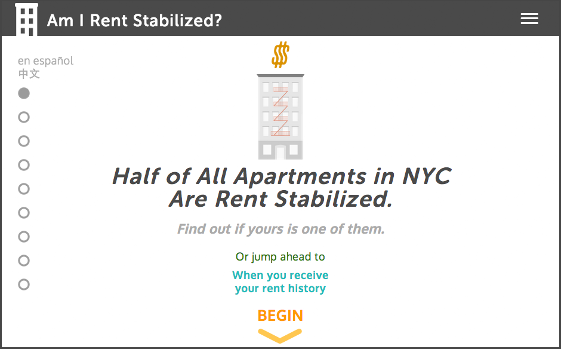

Am I Rent Stabilized?
============================


A mobile friendly, multi-lingual web app that informs NYC residents about [Rent Stabilization](http://www.nycrgb.org/html/resources/faq/rentstab.html) by simplifying the process of how to find out if their apartment may be rent stabilized, if they are paying too much rent, and what to do about it.  

See it in action at [amirentstabilized.com](https://amirentstabilized.com/).

## Develop
Requires familiarity with the Command Line Interface, as well as installations of NodeJS v10.16.2 and Yarn ~v1.22.

**Note** that if you do not the have the specified NodeJS version above (source of truth is the [`package.json`](./app/package.json) "engines" field) then the scrips below will not run. You can use [Node Version Manager (nvm)](https://github.com/nvm-sh/nvm) to switch between different NodeJS versions in a shell.

### Available Scripts

**Note**  that the following commands assume to be run from the `./app` directory.

First be sure to install the required 3rd party dependencies:

```
yarn install
```

To start have Webpack watch for changes and serve the site using Webpack Dev Server:

```
yarn start
```

To create a production optimized build (will output assets to the `app/dist` directory):

```
yarn prod
```

To run the tests in watch mode (_highly recommended during development!_):

```
yarn test:watch
```

To debug Webpack build issues, create a "debug" build by doing:

```
yarn webpack:debug
```

To serve the assets of the production build do:

```
yarn start:prod
```

### Other

The `handlebars-loader` Webpack loader handles the `.hbs` file extension so Webpack won't complain. It will automatically look for any Handlebars partials in `app/src/hbs_partials` and helpers in `app/src/hbs_helpers`.

Note that any newly added Handlebars partials will need to be registered with Jest in order for the unit tests not to break. See `src/setupJest.js` for how this is done.


## Updating the Site's Content:
The app uses Handlebars.JS for translating content between three supported languages: English, Spanish, and Chinese. *Any changes made to any of the written content in any of the HTML pages will need to be reflected in the corresponding locales JSON and potentially the Handlebars template files*.

These files are located as follows:

- `app/public/locales`: JSON files for locales. The naming convention used is `[page name]-[language code].json`.
- `app/src/hbs_templates`: Handlebars template files that correspond to the websites HTML pages 

Note that in both sets of files `main` maps to `index.html`

Additionally, all supported languages are specified in `app/src/constants/locales.js`.

### Adding a New Translation

Adding a new language translation will require:

1. New `locale` JSON files for each corresponding HTML page
2. Updating the constants `LANG` and `IN_LANG` in `app/src/constants/locales.js`
3. Updating the UI to display the new language option. The corresponding UI files are:  
    - The Handlebars `language_toggle` partial
    - The Components `languageToggle.js` and `languageToggleButton.js` in `app/src/components`.

If many lanugages are to be supported in the future, then a dropdown / select menu may be more appropriate than individual language toggle buttons.

Note that currently "right to left" languages are not supported in the UI.

## Data Sources and Processing:

See the [`data/`](./data) directory for a Makefile and Docker container configurations for generating the app's data.

The processed data is hosted and [publicly available for download on CARTO](https://chenrick.carto.com/tables/mappluto_likely_rs_2020_v8/public/map).

## Credits
- Big thanks to [Caroline Woolard](http://carolinewoolard.com/) for suggesting the idea to me.

- [Jue Yang](https://github.com/jueyang) designed the awesome building graphics which informed the overall redesign of version 2 of the site.

- [Eric Brelsford](http://ebrelsford.github.io/portfolio/) and [BetaNYC](http://betanyc.us/) provided motivational and technical support.

- [Radish Lab](http://radishlab.com/) contributed the design mockups for version 2.

- [John Krauss](http://blog.johnkrauss.com/) provided data for NYC properties that should have rent-stabilized apartments due to receiving tax exemptions from state programs such as 421a. (You can learn more on the the repo for [nyc-stabilization-unit-counts](https://github.com/talos/nyc-stabilization-unit-counts)).

### Fullscreen Slides with GSAP's TweenLite, CSSPlugin and ScrollToPlugin Credit
Forked from [Chrysto](http://codepen.io/bassta/)'s Pen [Fullscreen slides with TweenLite, CSSPlugin and ScrollToPlugin](http://codepen.io/bassta/pen/kDvmC/).

A [Pen](http://codepen.io/anon/pen/XJqaRg) by [Captain Anonymous](http://codepen.io/anon) on [CodePen](http://codepen.io/).

[License](http://codepen.io/anon/pen/XJqaRg/license).

## LICENSE
[Creative Commons Attribution-NonCommercial ](http://creativecommons.org/licenses/by-nc/4.0/)   
(CC BY-NC)

In other words: **_Not For Profit!_**
