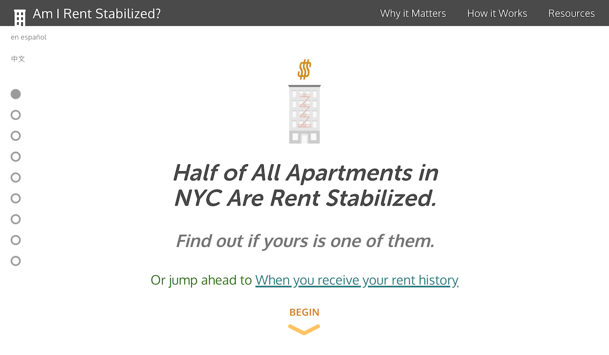

# Am I Rent Stabilized?



A mobile friendly, multi-lingual web app that informs NYC residents about [Rent Stabilization](http://www.nycrgb.org/html/resources/faq/rentstab.html) by simplifying the process of how to find out if their apartment may be rent stabilized, if they are paying too much rent, and what to do about it.

See it in action at [amirentstabilized.com](https://amirentstabilized.com/).

## Develop

Requires familiarity with the Command Line Interface, as well as installations of NodeJS v22.14 and Yarn v4.91.

**Note** it is recommended to use [Node Version Manager (nvm)](https://github.com/nvm-sh/nvm) to switch between different NodeJS versions in a shell.

### Available Scripts

**Note** that the following commands assume to be run from the [`website`](./website/) directory.

See the [`website/package.json`](./website/package.json) for a full list of available scripts.

First be sure to install the required 3rd party dependencies:

```
yarn install
```

To start have Eleventy watch for changes and serve the site using a local web server:

```
yarn start
```

To create a production optimized build (will output assets to the `website/dist` directory):

```
yarn build
```

To serve the assets of the production build do:

```
yarn serve
```

## Updating the Site's Content:

The website handles rendering content in three supported languages: English, Spanish, and Chinese. Any changes made to any of the written content in any of the HTML pages will need to be reflected in the corresponding locales JSON and potentially the Handlebars layout template files.

These files are located as follows:

- `website/src/_data/locales/`: JSON files for supported locales. The naming convention used is `[page name]-[language code].json`.

- `website/src/_layouts/hbs_templates`: Handlebars template files that correspond to the website's HTML pages.

Note that in both sets of files `main-[lang].json` maps to `home.hbs`

### Adding a New Translation

Adding a new language translation will require:

1. New `locale` JSON files for each corresponding HTML page
2. Adding Eleventy templates in `website/src/content/[lang]/` for each HTML page in the new language
3. Updating the Netlify redirects settings in `website/netlify.toml`
4. Updating the UI to display the new language option on each page.

Note that RTL ("Right to Left") language support has not yet been tested. Supporting RTL languages may require additional work.

## Data Sources and Processing:

See the [`data/`](./data) directory for a Makefile and Docker container configurations for generating the app's data.

The processed data is hosted and [publicly available for download on CARTO](https://clausa.app.carto.com/map/9102794d-e704-4e91-95b8-582049b57ad1).

## Credits

- Big thanks to [Caroline Woolard](http://carolinewoolard.com/) for suggesting the idea to me.

- [Jue Yang](https://github.com/jueyang) designed the awesome building graphics which informed the overall redesign of version 2 of the site.

- [Eric Brelsford](http://ebrelsford.github.io/portfolio/) and [BetaNYC](http://betanyc.us/) provided motivational and technical support.

- [Radish Lab](http://radishlab.com/) contributed the design mockups for version 2.

- [John Krauss](http://blog.johnkrauss.com/) provided data for NYC properties that should have rent-stabilized apartments due to receiving tax exemptions from state programs such as 421a. (You can learn more on the the repo for [nyc-stabilization-unit-counts](https://github.com/talos/nyc-stabilization-unit-counts)).

### Fullscreen Slides with GSAP's TweenLite, CSSPlugin and ScrollToPlugin Credit

Forked from [Chrysto](http://codepen.io/bassta/)'s Pen [Fullscreen slides with TweenLite, CSSPlugin and ScrollToPlugin](http://codepen.io/bassta/pen/kDvmC/).

A [Pen](http://codepen.io/anon/pen/XJqaRg) by [Captain Anonymous](http://codepen.io/anon) on [CodePen](http://codepen.io/).

[License](http://codepen.io/anon/pen/XJqaRg/license).

## LICENSE

[Creative Commons Attribution-NonCommercial ](http://creativecommons.org/licenses/by-nc/4.0/)
(CC BY-NC)

In other words: **_Not For Profit!_**
